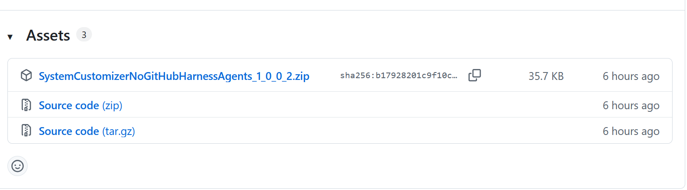
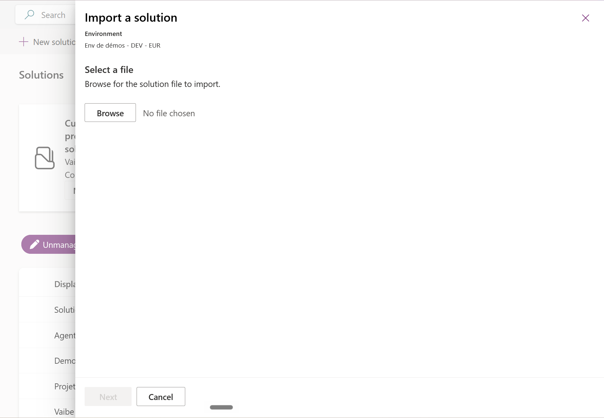
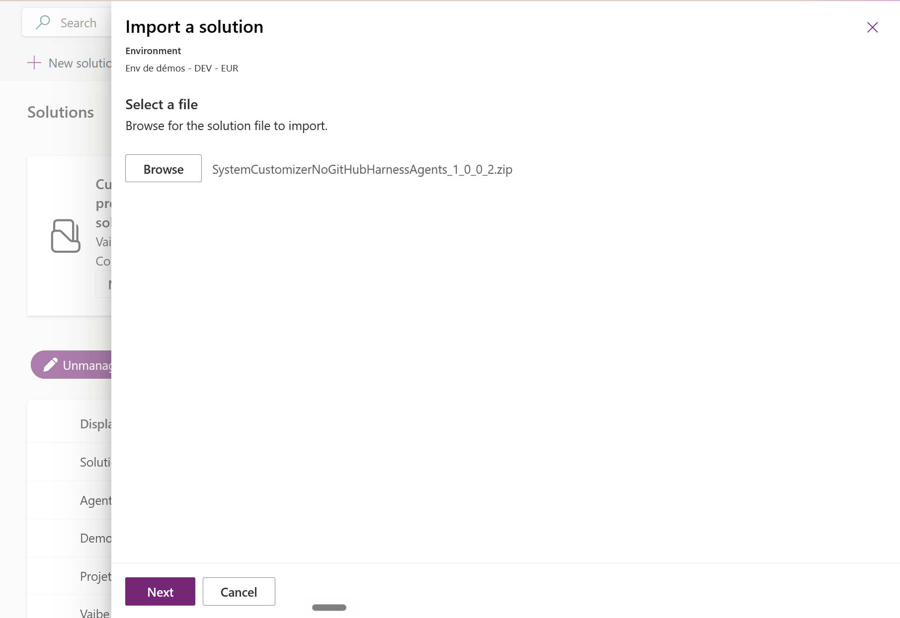
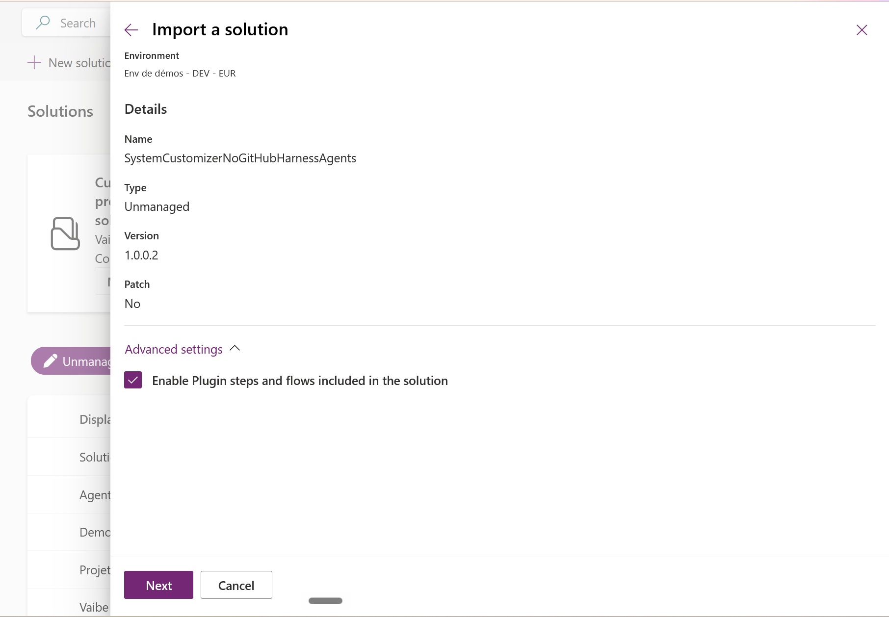
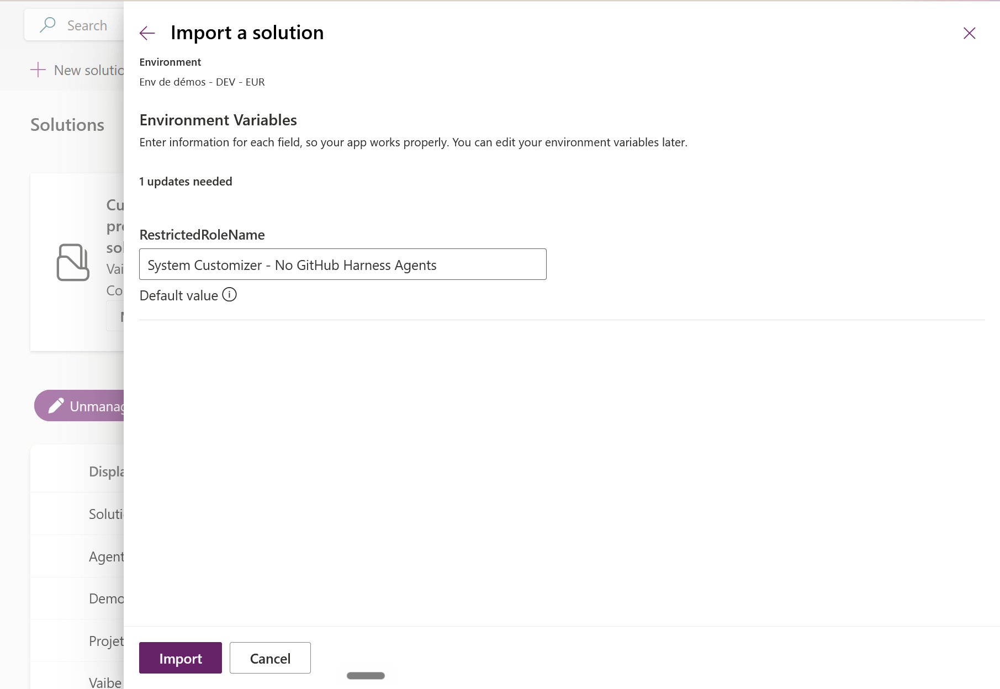
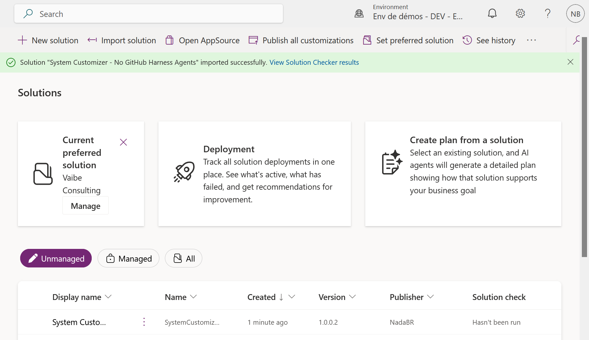
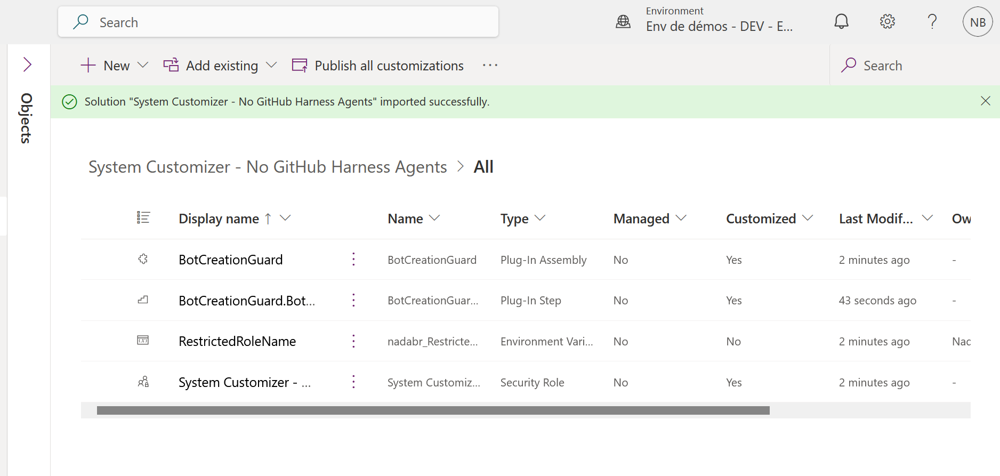
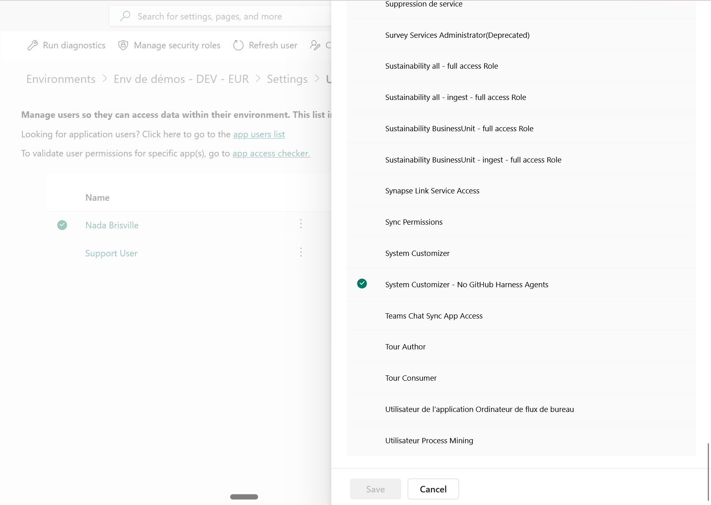
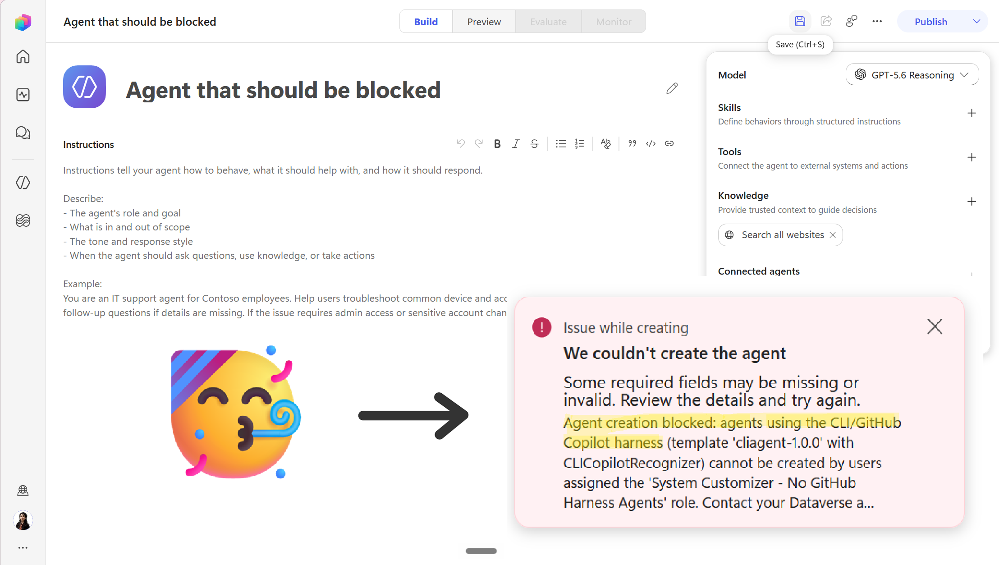

# Step by step installation

This guide is for anyone who wants the control running without building anything. No Visual
Studio, no Plugin Registration Tool, no code. Download a solution, import it, assign a role.

Once it is in place, any user holding the restricted security role is blocked from creating
Copilot Studio agents built on the CLI / GitHub Copilot harness. Everything else they do, including
creating ordinary agents, carries on untouched.

Count about ten minutes.

If you would rather understand how this works, or build it from source, read the
[README](README.md). The full write-up, including how the signal behind this was found, is on
Medium:
[Blocking GitHub Copilot Harness Agents in Copilot Studio](https://medium.com/@nada.brisville/blocking-github-copilot-harness-agents-in-copilot-studio-777f96a9e9c9).

---

## Before you start

**You need privileges to register plug-ins in the target environment.** System Administrator covers
it. Otherwise the account doing the import needs **Create** on `Plug-in Assembly`, `Plug-in Type`
and `SDK Message Processing Step`. System Customizer on its own is not enough, and the import fails
with `is missing prvCreatePluginAssembly privilege`.

**Copilot Studio must be provisioned in the target environment.** The solution declares a
dependency on the `PowerVirtualAgents` managed solution, because the plug-in step references the
`bot` table. Importing into an environment without Copilot Studio fails with an explicit
missing-dependency error.

**The solution is unmanaged.** That is deliberate, so you can adapt the role, the step or the
variable afterwards. The trade-off is that unmanaged customisations do not uninstall cleanly by
deleting the solution later.

---

## Step 1. Download the solution

Go to the [Releases](../../releases) page of this repository and download the `.zip` under
**Assets**. Take the one named after the solution, not the two **Source code** archives GitHub
adds automatically. Do not unzip it.

---

## Step 2. Import it into the target environment

Open [make.powerapps.com](https://make.powerapps.com) and switch to the environment you want to
protect, using the environment picker at the top right. Getting this wrong is the most common
mistake, so check the name before going further.

Go to **Solutions**, then **Import solution** in the command bar.

### 2.1 Select the file

The panel opens on **Select a file**, with **Next** greyed out until you give it something.

Choose **Browse**, pick the `.zip` you downloaded. The filename appears next to the button and
**Next** becomes available.

### 2.2 Check the details, and one checkbox

The panel now shows the solution name, its type and its version. Expand **Advanced settings** and
make sure **Enable Plugin steps and flows included in the solution** is **checked**.

**This checkbox matters more than anything else on this screen.** Left unchecked, the import
succeeds, every component lands correctly, and the guard blocks nothing at all, with no error
anywhere to tell you.

### 2.3 Confirm the environment variable

The wizard asks you to confirm the environment variables carried by the solution.
`RestrictedRoleName` arrives already filled in with the name of the security role, which is why
this works without any manual setup.

Leave it as it is. The value only needs changing if you intend to point the guard at a role that
already exists in your environment under a different name, which is covered at the end of this
guide.

Then select **Import** and wait. It usually takes a couple of minutes.

### 2.4 Confirm the import

You should get a green banner, and the solution appears in the **Unmanaged** list with its version
and publisher.

Open the solution and go to **Objects**. Four components must be listed:

| Component | Type |
|---|---|
| `BotCreationGuard` | Plug-In Assembly |
| `BotCreationGuard.BotCreationGuardPlugin: Create of bot` | Plug-In Step |
| `RestrictedRoleName` | Environment Variable |
| `System Customizer - No GitHub Harness Agents` | Security Role |

The **Plug-In Step** row is the one to look for. An assembly without its step imports without a
single error and blocks nothing.

---

## Step 3. Assign the role

Nothing is blocked until someone actually holds the restricted role. Assigning it is what puts a
user inside the restriction.

Go to the [Power Platform admin center](https://admin.powerplatform.microsoft.com), open your
environment, then **Settings → Users + permissions → Users**. Select a user, choose **Manage
security roles**, tick **System Customizer - No GitHub Harness Agents**, and save.

A few things worth knowing:

- **System Administrator does not exempt anyone.** The plug-in checks whether the restricted role
  is present, not what else the user can do. An admin who also carries this role is blocked like
  everybody else, which makes your own account a perfectly good test subject.
- **Roles inherited from a team count too.** If you assign the role to an Entra group team rather
  than to individuals, its members are covered.
- **The role is a copy of System Customizer.** Users receiving it keep the customization rights
  they need, and can still create ordinary agents.

---

## Step 4. Check that it actually works

Do not skip this. Every failure mode of this plug-in is silent and permissive: a misconfiguration
lets creations through rather than locking your environment out, which means a broken installation
and a working one look identical from the outside.

Sign in as a user holding the role, or assign it to yourself, and try to create an agent through
the CLI / GitHub Copilot harness in Copilot Studio. The creation is rejected, and the plug-in's
message comes through with the role name quoted inside it.

The generic wrapper (*"We couldn't create the agent"*) comes from Copilot Studio itself. The text
underneath it is what the plug-in throws.

Then create an ordinary agent with the same user. It should go through without any interference.
The restriction stays scoped to the single signal it was built to catch.

If the creation is **not** blocked, see the troubleshooting section below.

---

## Optional. Using a role that already exists in your environment

The solution ships its own security role, and most people should simply use it.

If you would rather point the guard at a role you already have, you do not need to rebuild
anything. Open the solution, select the `RestrictedRoleName` environment variable, and set a
**current value** to the exact name of your role. The plug-in reads the current value first and
falls back to the default value, so the current value wins.

Two warnings:

- The comparison is an **exact match on the role name**. A trailing space or a missing character
  makes the lookup fail, and it fails permissively, with no error.
- Set a **current value**, not a new default value. Current values are specific to an environment
  and do not travel with the solution.

---

## Troubleshooting

**The import failed with `is missing prvCreatePluginAssembly privilege`.**
The account doing the import lacks plug-in registration privileges. Import with a System
Administrator account, or grant Create on `Plug-in Assembly`, `Plug-in Type` and
`SDK Message Processing Step` to the role in question.

**The import failed on a missing dependency.**
Copilot Studio is not provisioned in the target environment, or it runs an older
`PowerVirtualAgents` version than the one the solution was exported against.

**Everything imported, but nothing is blocked.**
Work through these in order:

1. **Is the Plug-In Step in the solution?** Open **Objects** and check the four rows from step 2.4.
   A missing step is the most frequent cause.
2. **Was the Advanced settings checkbox ticked at import?** If not, the step arrived disabled.
   Re-import with the box ticked.
3. **Does the user actually hold the role?** Check under **Manage security roles**, or through
   their team membership.
4. **Does the environment variable value match the role name exactly?** Compare them character by
   character, including the final "s" of "Agents".

If all four check out, turn on plug-in trace logging and read what the plug-in itself reports. The
[README](README.md#verifying-it-actually-works) has the full procedure, and the trace names the
exact reason it let the creation through.

---

## What this does not cover

This control only protects the environments you install it in. A maker who can create a personal or
developer environment falls outside its reach entirely.

It also does not replace credit hygiene. In any environment with no business consuming credits,
allocate zero credits and turn off the tenant pool draw. That stops the same problem at the source
and takes one setting.

Licence: MIT.
